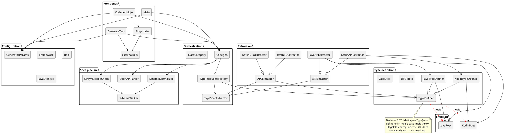
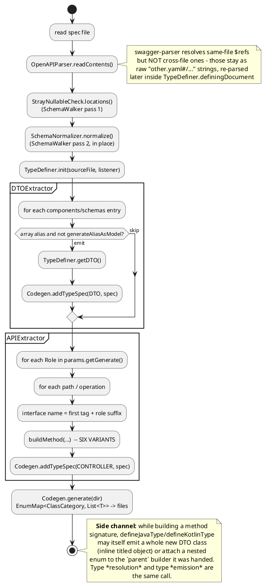
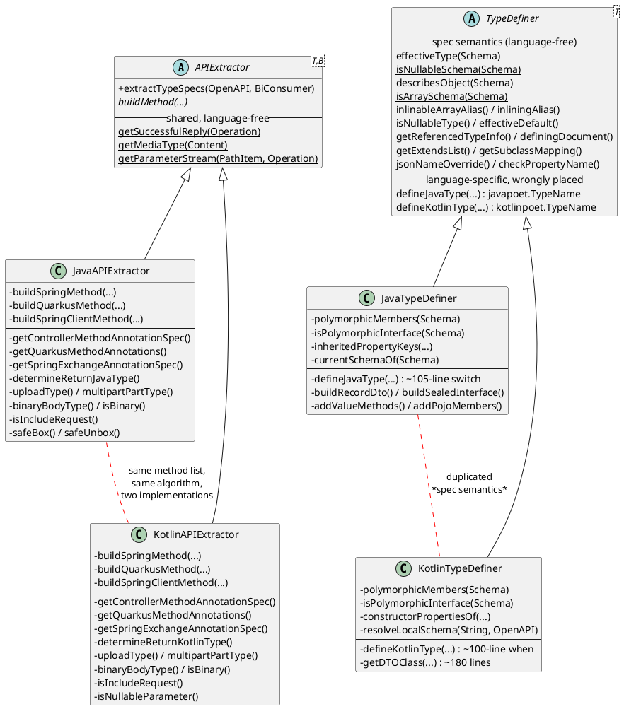
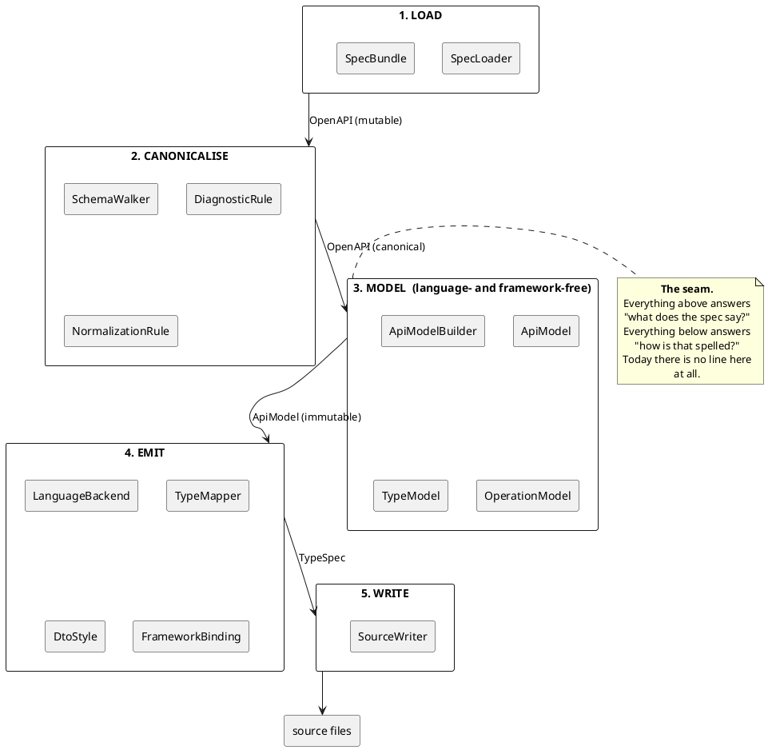
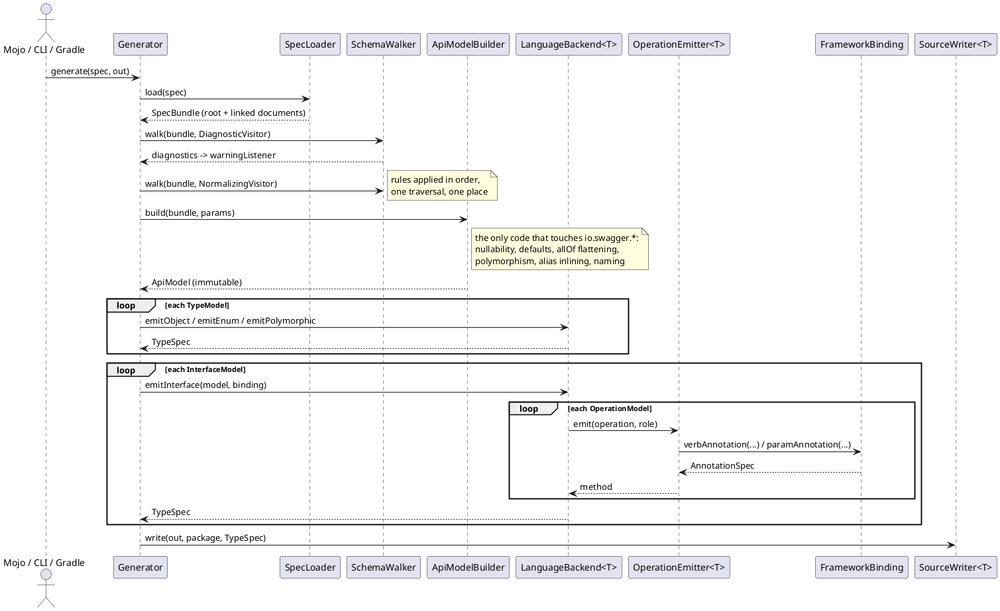
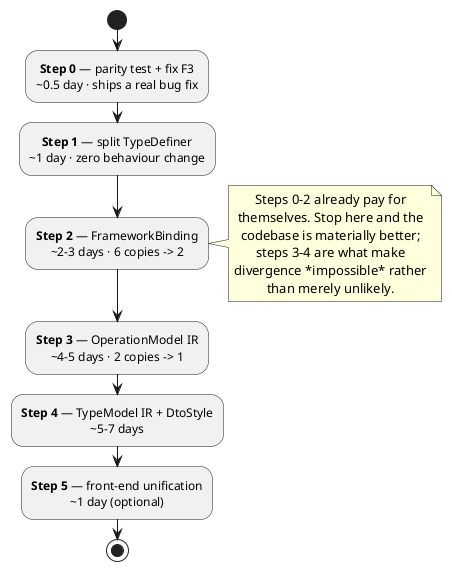

# Hurdy-Gurdy — architectural survey and refactoring proposal

*Survey date: 2026-09-18 · against `master` @ 366e999 · ~6.2 kLOC of `src/main` (4.6 kLOC Java, 1.5 kLOC Kotlin)*

---

## 0. Executive summary

The original brief — *"glue between swagger-parser and (java|kotlin)poet"* — is still an accurate
description of the **shape** of the code. It is no longer an accurate description of the **size** of
the problem, because four independent axes of variation have appeared since:

| Axis | Values | Where it is decided today |
|---|---|---|
| Target language | Java, Kotlin | class-per-language (`JavaTypeDefiner` / `KotlinTypeDefiner`, `JavaAPIExtractor` / `KotlinAPIExtractor`) |
| Target framework | Spring, Quarkus | `if (getFramework() == QUARKUS)` inside each language class |
| Interface role | Controller, Api, Client | `if (role == Role.CLIENT)` inside each language class |
| Java DTO style | Lombok, POJO, Records | `if (params.getJavaDtoStyle() == ...)` inside `JavaTypeDefiner` |

Only the **first** axis got a type. The other three got `if` statements, inside classes that were
already selected by the first axis. The product of those axes is the bloat: the algorithm
"turn one OpenAPI operation into one interface method" exists in **six near-identical copies**
(2 languages × {Spring-controller, Spring-client, Quarkus}), and the algorithm "decide what this
schema *means*" exists in **two** copies (once per language) even though it has nothing to do with
any language.

The single missing element is **an intermediate model**. Today a `io.swagger…Schema` is turned
directly into a `javapoet.TypeSpec` / `kotlinpoet.TypeSpec`. There is no place to put the answer to
"what does this spec say?" that is separate from "how do I spell it in language L for framework F".
So that answer is re-derived, inconsistently, at every emission site. That is not a style problem:
it has already produced at least one silent behavioural divergence between the Java and Kotlin
back ends (§2.3).

The recommendation is **not** a rewrite. It is four mechanical, individually shippable steps
(§5) that introduce the missing model and collapse the duplication, protected by the approval-test
suite that already exists (100 `.approved.txt` files plus a real compile-and-round-trip harness).

---

## 1. Current architecture, as built

### 1.1 Component view



### 1.2 Flow, as it actually runs



### 1.3 The duplication matrix, drawn



---

## 2. Findings

### 2.1 The generic parameter `<T>` does not type anything — F1 🔴

`TypeDefiner<T>` (`src/main/java/ru/curs/hurdygurdy/TypeDefiner.java:305-318`) declares *both*:

```java
com.palantir.javapoet.TypeName   defineJavaType(...)   { throw new IllegalStateException(); }
com.squareup.kotlinpoet.TypeName defineKotlinType(...) { throw new IllegalStateException(); }
```

Consequences:

* The language-neutral base class **imports both code generators**. `JavaAPIExtractor` calls
  `typeDefiner.defineJavaType(...)` through a `TypeDefiner<TypeSpec>` reference — nothing in the
  type system stops it calling `defineKotlinType` instead; the guard is a runtime throw.
* `defineKotlinType` carries a fifth parameter (`nullableOverride`) that `defineJavaType` does not,
  because Kotlin needs to push nullability down and Java does not. The signature is therefore a
  union of two unrelated contracts.
* `TypeProducersFactory<T>` exists solely to re-tie the knot that `<T>` failed to tie.

`<T>` is doing the job of an `Object`-typed field with a cast. The abstraction that *should* be
there is a **type-mapper strategy** whose output type is genuinely parametric, with no
cross-language members on the shared base.

### 2.2 One algorithm, six copies — F2 🔴

`JavaAPIExtractor.buildSpringMethod`, `buildQuarkusMethod` and `buildSpringClientMethod`
(`JavaAPIExtractor.java:141`, `:219`, `:295`) have the same six-phase body:

1. create the method builder, `PUBLIC ABSTRACT`
2. add the verb/path annotation
3. set the return type from the 2xx response
4. add request-body parameters
5. add path, then query, then header parameters — three near-identical
   `getParameterStream(...).filter(in == …).forEach(…)` blocks
6. optionally add the response/request parameter

Only step 2, the annotation *names* in step 5, and the response-parameter convention in step 6
differ. `KotlinAPIExtractor` repeats all three, with the same private method names
(`buildSpringMethod`, `buildQuarkusMethod`, `buildSpringClientMethod`,
`getQuarkusMethodAnnotations`, `getControllerMethodAnnotationSpec`, `uploadType`,
`multipartPartType`, `binaryBodyType`, `isBinary`, `isIncludeRequest`).

Adding a third framework today costs **two** new ~90-line methods plus two new annotation-constant
blocks, and every future fix must be applied in 2–6 places. This is the main source of the "bloat"
in the brief.

### 2.3 The duplication has already produced a silent divergence — F3 🔴 *(real defect)*

`TypeDefiner.effectiveDefault(schema, openAPI)` resolves a parameter's default value *through a
`$ref`*, and its own Javadoc says both the annotation and the nullability must be decided from it.

It is called from `KotlinAPIExtractor` (six sites) — and from nowhere in the Java back end.
All three Java builders instead read the schema raw:

```java
Optional.ofNullable(parameter.getSchema()).map(Schema::getDefault)   // JavaAPIExtractor:186, 270, 338
```

So for a parameter written as `schema: {$ref: '#/components/schemas/PageSize'}` where `PageSize`
declares `default: 20`:

| Back end | Emitted |
|---|---|
| Kotlin | `@RequestParam(name="page_size", required=false, defaultValue="20")` |
| Java | `@RequestParam(name="page_size", required=false)` — **default lost** |

Nothing in the build catches this, because the Java and Kotlin approval suites use different
fixtures and there is no cross-language parity assertion for parameter defaults. This is exactly
the class of bug that an intermediate model makes structurally impossible: `effectiveDefault` would
be called **once**, when the model is built, and both emitters would read the same field.

*(`Oas31ParityTest` shows the parity idea is already understood — it is just not applied to the
API-extraction path.)*

### 2.4 There are two traversal mechanisms with different coverage — F4 🟡

`SchemaWalker` is a genuinely good Visitor: identity-based cycle detection, JSON-pointer paths, full
JSON Schema 2020-12 applicator coverage (`prefixItems`, `contains`, `patternProperties`,
`if`/`then`/`else`, `unevaluated*`…). Its own Javadoc states the invariant: *"a schema the walk
misses is one the generator handles without ever having been checked."*

But it has exactly two clients — `StrayNullableCheck` and `SchemaNormalizer`. The type definers do
**their own** recursive descent (`defineJavaType` recursing into `getItems()`, `getAnyOf()`;
`inheritedPropertyKeys` walking `allOf`), with **their own** cycle guard
(`TypeDefiner.aliasesBeingInlined`, a name-keyed `HashSet` separate from `SchemaWalker`'s identity
set). The two disagree about what "every schema" means.

The symptom of this split: the normalizer canonicalises constructs the definers then never look at,
and the definers read constructs whose canonicalisation the normalizer's contract only *implies*.

### 2.5 Type *resolution* and type *emission* are the same call — F5 🔴

`defineJavaType(schema, openAPI, parent, typeNameFallback)`:

* **returns** a `TypeName` (resolution), **and**
* calls `parent.addType(internalEnum)` for an inline enum (emission into a caller-supplied builder), **and**
* calls `typeSpecBiConsumer.accept(ClassCategory.DTO, getDTO(...))` for an inline titled object
  (emission into the *global* output sink).

Three responsibilities and two output channels in one method, which is why:

* every caller must thread a `TypeSpec.Builder parent` through, even when it only wants a name;
* `defineJavaType` needs the `parentIsInterface` flag purely so a nested enum gets the right
  modifiers — a *layout* concern leaking into a *naming* function;
* generation order is not reasoned about anywhere. `Codegen.addTypeSpec` appends without
  deduplication, so the same titled inline schema reached from two properties is emitted twice and
  the second file silently overwrites the first on disk.

### 2.6 Spec semantics are duplicated per language — F6 🟠

Logic that has nothing to do with Java or Kotlin exists in both definers:

| Concept | Java | Kotlin |
|---|---|---|
| polymorphic members (`oneOf`, or `anyOf` of ≥2 `$ref`s) | `JavaTypeDefiner.polymorphicMembers:220` | `KotlinTypeDefiner.polymorphicMembers:259` |
| "is this a polymorphic base?" | `isPolymorphicInterface:236` | `isPolymorphicInterface:265` |
| `allOf` inheritance resolution | `inheritedPropertyKeys` / `inheritedComponents` | `constructorPropertiesOf` |
| the "current" (non-`$ref`) member of an `allOf` | `currentSchemaOf` | inline in `getDTOClass` |
| local `$ref` resolution | `schemasOf` + `extractGroup` | `resolveLocalSchema` |

`TypeDefiner` already collects a good deal of this correctly (`effectiveType`, `isNullableSchema`,
`describesObject`, `isArraySchema`, `isNullableType`, `effectiveDefault`). The class is simply not
*named* for that job, so new semantics land wherever they are first needed.

### 2.7 Smaller items — F7 🟢

* **Empty subclasses as ceremony.** `JavaDTOExtractor` and `KotlinDTOExtractor` are 25-line files
  whose bodies are a constructor calling `super`. They exist only to satisfy
  `TypeProducersFactory.typeSpecExtractors`. Delete both; hand `DTOExtractor` the definer directly.
* **Demeter breach with a split policy.** `DTOExtractor` reads
  `typeDefiner.params.isGenerateAliasAsModel()` (package-private field hop) to decide *whether a
  class exists*, while the matching decision (*inline the alias at the use site*) lives in
  `TypeDefiner.inlinableArrayAlias`. One policy, two owners, no shared name.
* **Three hand-rolled front-end config builders.** `CodegenMojo.execute`, `Main.call` and the Gradle
  `GenerateTask` each rebuild `GeneratorParams` with the same seven-call chain and the same
  `"java".equalsIgnoreCase(language) ? new JavaCodegen(…) : new KotlinCodegen(…)` ternary. Language
  selection has no enum in core (the Gradle plugin has its own `Language`).
* **Flat package.** 26 Java + 2 Kotlin files in one `ru.curs.hurdygurdy` package. Nothing tells a
  reader that `SchemaWalker` is infrastructure and `JavaAPIExtractor` is a leaf.
* **`Role` is both a name-suffix supplier and a behaviour switch.** `role != Role.API` in
  `APIExtractor`, `role == Role.CLIENT` in `JavaAPIExtractor`, `role == Role.CONTROLLER` in the
  Quarkus branch — three different questions asked of one enum in three different files.

---

## 3. What is *good* and must be preserved

Refactoring proposals that ignore this tend to make things worse, so it is worth stating:

1. **`SchemaWalker` + `SchemaNormalizer` is exactly the right idea**, and its Javadoc explains *why*
   normalisation is keyed on keyword presence rather than document version. That reasoning is the
   most valuable prose in the repo. The target design generalises it, it does not replace it.
2. **The "one canonical answer per question" discipline** in `TypeDefiner.isNullableType` /
   `effectiveDefault` (with the issue-620 note explaining what three divergent copies cost) is the
   right instinct. The refactoring below is a systematic application of it.
3. **The test net is strong enough to refactor against**: 100 `.approved.txt` snapshots, plus
   `GeneratedCodeCompiler` (generated Java/Kotlin is actually compiled), plus round-trip
   serialisation tests (`DtoRoundTripTest`, `KotlinRoundTripTest`, `DateSerdeTest`), plus Gradle
   functional tests covering build cache and determinism. Very few generators have this.
4. **`Fingerprint` + `ExternalRefs`** are cleanly separated, well documented, and correctly shared
   between the Maven and Gradle front ends. Leave them alone.

---

## 4. Target architecture

### 4.1 The one structural change: an intermediate model



### 4.2 Target class model

```plantuml
@startuml target-classes
skinparam classAttributeIconSize 0
hide empty members

package spec {
  interface SchemaVisitor <<visitor>> {
    +visit(Schema, SchemaLocation)
  }
  class SchemaWalker <<visitor engine>> {
    +{static} walk(OpenAPI, SchemaVisitor)
  }
  class NormalizingVisitor
  class DiagnosticVisitor
  class CompositeVisitor
  SchemaVisitor <|.. NormalizingVisitor
  SchemaVisitor <|.. DiagnosticVisitor
  SchemaVisitor <|.. CompositeVisitor
  SchemaWalker ..> SchemaVisitor

  interface NormalizationRule <<chain>> {
    +apply(Schema, SchemaLocation, Diagnostics)
  }
  class WidenUntypedArray
  class TypeFromConst
  class BinaryFromContentEncoding
  class DropNullEnumMember
  class CanonicalAdditionalProperties
  NormalizationRule <|.. WidenUntypedArray
  NormalizationRule <|.. TypeFromConst
  NormalizationRule <|.. BinaryFromContentEncoding
  NormalizationRule <|.. DropNullEnumMember
  NormalizationRule <|.. CanonicalAdditionalProperties
  NormalizingVisitor o-- "*" NormalizationRule

  class SpecLoader {
    +load(Path) : SpecBundle
  }
  class SpecBundle {
    +root : OpenAPI
    +linked : Map<String, OpenAPI>
    +documentOf(ref) : OpenAPI
  }
  class SchemaSemantics <<utility>> {
    +{static} effectiveType(Schema)
    +{static} isNullableSchema(Schema)
    +{static} describesObject(Schema)
    +{static} isArraySchema(Schema)
    +{static} polymorphicMembers(Schema)
  }
  SpecLoader --> SpecBundle
}

package model {
  class ApiModel {
    +types : List<TypeModel>
    +interfaces : List<InterfaceModel>
  }
  abstract class TypeModel {
    +name : String
    +packageName : String
  }
  class ObjectType {
    +properties : List<PropertyModel>
    +superTypes : List<TypeRef>
    +additionalProperties : TypeRef
    +discriminator : DiscriminatorModel
    +nested : List<TypeModel>
  }
  class EnumType {
    +constants : List<EnumConstant>
  }
  class PolymorphicType {
    +members : List<TypeRef>
  }
  class ArrayAliasType {
    +element : TypeRef
  }
  TypeModel <|-- ObjectType
  TypeModel <|-- EnumType
  TypeModel <|-- PolymorphicType
  TypeModel <|-- ArrayAliasType

  class PropertyModel {
    +specKey : String
    +identifier : String
    +jsonNameOverride : String
    +type : TypeRef
    +required : boolean
    +nullable : boolean
    +defaultValue : String
  }
  class TypeRef {
    +kind : Kind
    +format : Format
    +nullable : boolean
    +element : TypeRef
    +target : TypeModel
  }
  ObjectType o-- "*" PropertyModel
  PropertyModel --> TypeRef

  class InterfaceModel {
    +name : String
    +role : Role
    +operations : List<OperationModel>
  }
  class OperationModel {
    +id : String
    +httpMethod : HttpMethod
    +path : String
    +parameters : List<ParameterModel>
    +body : BodyModel
    +response : ResponseModel
  }
  class ParameterModel {
    +specName : String
    +identifier : String
    +in : ParamIn
    +type : TypeRef
    +required : boolean
    +defaultValue : String
  }
  InterfaceModel o-- "*" OperationModel
  OperationModel o-- "*" ParameterModel

  class ApiModelBuilder <<builder>> {
    +build(SpecBundle, GeneratorParams) : ApiModel
    -- the ONLY reader of io.swagger.* --
  }
  ApiModelBuilder --> ApiModel
}

package emit {
  interface "LanguageBackend<T>" as LB <<strategy>> {
    +typeMapper() : TypeMapper
    +emitObject(ObjectType) : T
    +emitEnum(EnumType) : T
    +emitPolymorphic(PolymorphicType) : T
    +emitArrayAlias(ArrayAliasType) : T
    +emitInterface(InterfaceModel, FrameworkBinding) : T
    +writer() : SourceWriter
  }
  class JavaBackend
  class KotlinBackend
  LB <|.. JavaBackend
  LB <|.. KotlinBackend

  interface "TypeMapper<TN>" as TM <<strategy>> {
    +map(TypeRef) : TN
  }
  class JavaTypeMapper
  class KotlinTypeMapper
  TM <|.. JavaTypeMapper
  TM <|.. KotlinTypeMapper
  note bottom of KotlinTypeMapper
    applies TypeRef.nullable via
    .copy(nullable = true);
    JavaTypeMapper only boxes.
    Kills defineKotlinType's extra
    `nullableOverride` argument.
  end note

  interface FrameworkBinding <<strategy>> {
    +verbAnnotation(HttpMethod, path, Role)
    +paramAnnotation(ParameterModel)
    +bodyAnnotation(BodyModel)
    +multipartPartType()
    +binaryBodyType()
    +wrapReturn(TypeRef, Role, boolean)
    +contextParameters(OperationModel, Role, boolean)
  }
  class SpringBinding
  class SpringHttpInterfaceBinding
  class QuarkusBinding
  FrameworkBinding <|.. SpringBinding
  FrameworkBinding <|.. SpringHttpInterfaceBinding
  FrameworkBinding <|.. QuarkusBinding

  interface DtoStyle <<strategy>> {
    +decorate(ObjectType, builder)
  }
  class LombokStyle
  class PojoStyle
  class RecordStyle
  DtoStyle <|.. LombokStyle
  DtoStyle <|.. PojoStyle
  DtoStyle <|.. RecordStyle
  JavaBackend o-- DtoStyle

  class "OperationEmitter<T>" as OE <<template method>> {
    +emit(OperationModel, Role) : T
    -- ONE algorithm for every
       language x framework --
  }
  OE --> LB
  OE --> FrameworkBinding

  interface "SourceWriter<T>" as SW <<strategy>> {
    +write(Path, String, T)
  }
  class JavaFileWriter
  class KotlinFileWriter
  SW <|.. JavaFileWriter
  SW <|.. KotlinFileWriter
}

class Generator {
  +generate(Path spec, Path out)
}
Generator --> SpecLoader
Generator --> SchemaWalker
Generator --> ApiModelBuilder
Generator --> LB
@enduml
```



### 4.3 Target sequence



### 4.4 Pattern inventory

| Pattern | Applied to | Replaces |
|---|---|---|
| **Visitor** | `SchemaVisitor` over `SchemaWalker`; *all* schema traversal, including the model builder's | the definers' ad-hoc recursion and second cycle guard (F4) |
| **Chain of Responsibility** | `NormalizationRule`, `DiagnosticRule` | the five hard-wired calls in `SchemaNormalizer.normalizeSchema` |
| **Builder** | `ApiModelBuilder` | nothing — this is the new layer |
| **Strategy** | `LanguageBackend`, `TypeMapper`, `FrameworkBinding`, `DtoStyle`, `SourceWriter` | class-per-language plus `if (framework == …)` plus `if (javaDtoStyle == …)` (F2) |
| **Abstract Factory** | `LanguageBackend` as factory for its mapper / writer / emitter | `TypeProducersFactory` (survives, simplified) |
| **Template Method** | `OperationEmitter.emit` — fixed six-phase algorithm, strategy-supplied steps | the six `build*Method` copies (F2, F3) |
| **Value Object** | `TypeRef`, `PropertyModel`, `OperationModel` | re-deriving semantics from `Schema` at each emission site (F6) |

The crucial design call is **where the seam goes**. It goes at the model, *not* at an abstraction
over JavaPoet and KotlinPoet. Those two libraries are genuinely different — KotlinPoet has
nullability, properties, `data` and `sealed` classes; JavaPoet has records, fields and Lombok
annotations. Any common `CodeBuilder` façade would leak on day one. See §6.

### 4.5 Target package layout

```
ru.curs.hurdygurdy
├── spec/        SpecLoader, SpecBundle, SchemaWalker, SchemaVisitor, SchemaSemantics,
│                NormalizationRule + rules, DiagnosticRule + rules
├── model/       ApiModel, TypeModel hierarchy, TypeRef, PropertyModel,
│                InterfaceModel, OperationModel, ParameterModel, ApiModelBuilder
├── emit/        LanguageBackend, TypeMapper, SourceWriter, OperationEmitter
│   ├── java/    JavaBackend, JavaTypeMapper, DtoStyle (Lombok/Pojo/Record), JavaFileWriter
│   └── kotlin/  KotlinBackend, KotlinTypeMapper, KotlinFileWriter
├── binding/     FrameworkBinding, SpringBinding, SpringHttpInterfaceBinding, QuarkusBinding
├── config/      GeneratorParams, Language, Framework, Role, JavaDtoStyle, ClassCategory
└── build/       CodegenMojo, Main, Fingerprint, ExternalRefs
```

---

## 5. Migration plan

Five steps. Each is independently shippable, each keeps every `.approved.txt` byte-identical except
where explicitly noted, and none requires touching the Gradle plugin or the public
`GeneratorParams` API.

### Step 0 — close the safety net *(prerequisite, ~0.5 day)*

Before moving anything, add a **parity test** that runs one fixture spec through both back ends and
asserts the *semantic* facts agree: every operation has the same parameter names, the same required
flags and **the same default values**. `Oas31ParityTest` is the template.

That test **fails immediately** on F3 (§2.3). Fix `JavaAPIExtractor` to call
`typeDefiner.effectiveDefault(parameter.getSchema(), openAPI)` in all three builders, re-approve the
affected Java snapshots, ship it. *This is a bug fix worth doing whether or not the rest of the
refactoring happens.*

Also verify the approval matrix genuinely covers java×kotlin × spring×quarkus ×
controller×api×client × lombok×pojo×records, and fill the gaps. Everything below leans on it.

### Step 1 — split `TypeDefiner` *(mechanical, ~1 day, zero behaviour change)*

1. Move every language-free member of `TypeDefiner` into a new final `spec.SchemaSemantics`:
   `effectiveType`, `isNullableSchema`, `describesObject`, `isArraySchema`, `isNullableAnyOf`,
   `polymorphicMembers` (deleting the two copies from the definers), `getExtendsList`,
   `getSubclassMapping`, `getEnumName`, `jsonNameOverride`, `checkPropertyName`, `extractGroup`
   and the three `Pattern` constants.
2. Move `definingDocument` / `externalDocuments` / `externalClasses` / `getReferencedTypeInfo` into
   `spec.SpecBundle` — a document cache is not a property of a type definer.
3. Delete `defineJavaType` / `defineKotlinType` from the base. `JavaAPIExtractor` already *holds* a
   `JavaTypeDefiner` and `KotlinAPIExtractor` a `KotlinTypeDefiner`; they merely declare the base
   type. `TypeDefiner` then imports neither poet.
4. Delete `JavaDTOExtractor` and `KotlinDTOExtractor`; make `DTOExtractor` concrete and give it
   `GeneratorParams` directly instead of hopping through `typeDefiner.params`.

**Payoff:** F1 and most of F7 gone, F6 halved; `TypeDefiner` drops from 520 to roughly 150 lines and
becomes honest about its job.

### Step 2 — extract `FrameworkBinding` *(~2–3 days)*

Per language, collapse `buildSpringMethod` + `buildQuarkusMethod` + `buildSpringClientMethod` into
one `buildMethod` parameterised by a `FrameworkBinding` that supplies only the annotation
vocabulary (verb, path/query/header parameter, body, multipart part type, binary body type, return
wrapping, context parameters).

Note that "Spring client" is really a *third binding* (`@GetExchange` and friends), not a role
special case. Modelling it as `SpringHttpInterfaceBinding` removes the `role == Role.CLIENT` test
from dispatch and makes the Quarkus `@RegisterRestClient` path symmetrical.

**Payoff:** six copies → two. A new framework becomes one ~80-line binding class shared by both
languages. F2 halved.

### Step 3 — introduce `OperationModel` and the model builder for the API path *(~4–5 days)*

Add `model/` for the operation side only: `InterfaceModel`, `OperationModel`, `ParameterModel`,
`BodyModel`, `ResponseModel`, `TypeRef`, and an `ApiModelBuilder` that reads `io.swagger.*` **once**.
`JavaBackend` and `KotlinBackend` then consume `OperationModel` and never touch a `Schema`.

`OperationEmitter` becomes the single six-phase Template Method; the only remaining per-language
code is `TypeMapper` (`TypeRef` → `javapoet.TypeName` / `kotlinpoet.TypeName`) plus method-builder
mechanics.

**Payoff:** F2 and F3 structurally eliminated — a Java/Kotlin divergence in *what the spec means*
stops being expressible. F5 partly addressed: type resolution no longer emits anything.

### Step 4 — the same for DTOs *(~5–7 days, the largest step)*

The `TypeModel` hierarchy plus the DTO half of `ApiModelBuilder`. `allOf` flattening, discriminator
handling, alias inlining and polymorphism detection move there, once. `JavaDtoStyle` becomes three
`DtoStyle` strategies rather than seven `if` branches spread through a 1170-line class.

This is where the remaining `parent` / `parentIsInterface` threading disappears: nested enums become
`EnumType` children of their `ObjectType`, and the backend decides layout and modifiers. Add
deduplication of emitted types in `Generator` while you are there (F5, the silent-overwrite case).

### Step 5 — front-end unification *(optional, ~1 day)*

A `config.Language` enum in core plus one `GeneratorParams.from(...)` factory used by `CodegenMojo`,
`Main` and the Gradle `GenerateTask`. Removes three copies of the same seven-call chain and the
`"java".equalsIgnoreCase(language) ? … : …` ternary.

### Sequencing



---

## 6. What *not* to do

* **Do not abstract over JavaPoet and KotlinPoet.** A shared `CodeBuilder` façade is the obvious
  move and the wrong one: Kotlin needs nullable types, properties, primary constructors, `data` and
  `sealed`; Java needs fields, explicit accessors, records and Lombok annotations. The façade would
  become the union of both and leak immediately. The seam belongs at the model (§4.1).
* **Do not make `SchemaWalker` serve the generator before Step 3.** The generator's traversal is
  *demand-driven* (resolve this property's type now); the walker's is *document-order*. They unify
  naturally once `ApiModelBuilder` exists, and awkwardly before.
* **Do not renumber or restyle `.approved.txt` files during the refactoring.** Re-approve only the
  snapshots a step genuinely changes, preserving existing line endings; a bulk normalisation would
  destroy the very signal the refactoring depends on.
* **Do not publish `FrameworkBinding` as an SPI yet.** An internal interface is enough. Publishing
  it commits to a contract before Step 3 has shown what that contract should be.
* **Do not merge `Framework` and `Role`.** They are genuinely orthogonal; the current confusion is
  that *Spring-client* is a binding masquerading as a role (Step 2 fixes that), not that the two
  enums should be one.

---

## 7. Scorecard

| Finding | Severity | Fixed by |
|---|---|---|
| F1 `<T>` does not type anything; base class imports both poets | 🔴 | ✅ Step 1 |
| F2 one operation-emission algorithm in six copies | 🔴 | ✅ Steps 2 + 3 — one reader, two emitters |
| F3 **`effectiveDefault` not applied on the Java path — `$ref` defaults silently dropped** | 🔴 *defect* | ✅ Step 0 (fixed); Step 3 (made unrepresentable) |
| F4 two traversal mechanisms with different coverage and cycle guards | 🟡 | Steps 3 + 4 |
| F5 type resolution and type emission are the same call; no dedup on output | 🔴 | Step 4 |
| F6 spec semantics duplicated per language | 🟠 | ◐ Step 1 (schema predicates); Step 4 (the rest) |
| F7 empty subclasses, Demeter breach, 3× front-end config, flat package | 🟢 | ◐ Step 1 (first two); Step 5 (the rest) |
| F8 **Java generation aborted on any hyphenated header parameter** | 🔴 *defect* | ✅ Step 0 |
| F9 **Java never emitted a header parameter's default** (Spring and Quarkus) | 🔴 *defect* | ✅ Step 0 |

### 7.1 Step 0, as executed

`ApiParityTest` now generates each fixture through both back ends under eight
configurations (Spring and Quarkus × controller, api, client) and compares the parameter bindings
— where each value comes from, its name on the wire, its `required` flag, its default — rather than
the generated text, which the two languages legitimately spell differently. 64 cases.

Writing it surfaced two defects beyond the predicted F3, both in the same place and both for the
same reason: no fixture had ever put a hyphenated header parameter through the Java back end.

* **F8** — `CaseUtils.kebabToCamel` emitted a hyphen in second position instead of treating it as a
  separator, so `X-Trace-Id` became `x-TraceId`. KotlinPoet hid that behind back-quotes;
  JavaPoet rejected it, and **Java generation failed outright** with
  `IllegalArgumentException: not a valid name`. Any specification with an `X-`-style header — that
  is, most real ones — could not be generated as Java at all.
* **F9** — the Java extractor emitted a parameter's default for query parameters only, never for
  headers, in any of its three builders. The Kotlin extractor emitted both.

Fixing F8 changed the Kotlin identifiers too (`` `x-TraceId` `` → `xTraceId`), which is the
identifier the function's own name always promised; three Kotlin snapshots were re-approved for
that line and nothing else. Wire names are untouched.

Approval-matrix gaps found and filled: there was no Java snapshot for `issue617.yaml` (header
defaults, hyphenated names) under either framework, and no Java counterpart to the Kotlin
`externalRefNullabilityAndDefaults`. Three were added.

Gaps found and **not** filled, as they are unrelated to this step's changes:
Quarkus is never snapshotted with `Role.API`, nor with the `POJO` or `RECORDS` DTO styles, and the
Spring client is never snapshotted with either style. All are compiled — but not pinned — by
`youtrackOpenapiCompiles`, which runs every role under both frameworks.

### 7.2 Step 1, as executed

Not one generated byte changed: all 426 tests pass with every snapshot untouched, which is the
whole point of doing this step before any of the others.

| Moved out of `TypeDefiner` | To | Why |
|---|---|---|
| `effectiveType`, `isNullableSchema`, `describesObject`, `isArraySchema`, `getExtendsList`, `getEnumName`, `getSubclassMapping`, `extractGroup`, `checkReferenceIsGeneratable`, the `$ref` patterns, and the component lookups `nullableOf` / `defaultOf` / `isEnumComponent` | `SchemaSemantics` | answerable from the specification alone |
| `polymorphicMembers`, `isPolymorphicInterface` — **one copy deleted from each type definer** | `SchemaSemantics` | they were written out twice, identically |
| `sourceFile`, the parsed-linked-document cache, `definingDocument` | `LinkedDocuments` | parsing and caching files is not a type definer's job |

`defineJavaType` and `defineKotlinType` are gone from the base, so `TypeDefiner` imports neither
JavaPoet nor KotlinPoet and `<T>` is no longer a promise the class breaks. Each extractor now holds
the definer it actually uses, which `TypeProducersFactory<T, D extends TypeDefiner<T>>` supplies —
no cast, no runtime `IllegalStateException` standing in for a type.

`JavaDTOExtractor` and `KotlinDTOExtractor` (25 lines each, bodies empty) are deleted;
`DTOExtractor` is concrete and takes `GeneratorParams` instead of reaching through
`typeDefiner.params`.

`TypeDefiner` goes from 520 lines to 315, of which the remainder is genuinely about applying the
generator's configuration to a schema.

**Left for later, deliberately.** `JavaTypeDefiner.isNullable` is a fourth answer to the
nullability question: it asks the *current* document about a `$ref` rather than the one that
declares the component, so it differs from `TypeDefiner.isNullableType` for cross-file references.
Collapsing them is a behaviour change, not a move, and belongs to Step 4. It is commented in place.

**Not done in this step:** the package layout of §4.5. Moving these classes into `spec/` would force
`public` onto members that are package-private today, which publishes internals of a
Maven-Central artifact before the design has settled. The split of responsibility is what Step 1
was for; the directories can follow once Steps 3 and 4 have shown the shape.


### 7.3 Step 2, as executed

Again not one generated byte changed: 430 tests pass with every snapshot untouched. The snapshots
did real work this time — the emission path was rewritten under them — but a diff would have been a
bug in the refactoring, not something to re-approve, and none appeared.

The three `build*Method` copies per language collapse into one `buildMethod` driven by a
`FrameworkBinding`, which supplies only the vocabulary: the verb annotations, the parameter
annotations, the body and multipart annotations, the upload and binary body types, how the return
type is wrapped, and which context parameters the framework wants.

| | before | after |
|---|---|---|
| copies of the operation→method algorithm | 6 | 2 (one per language) |
| `JavaAPIExtractor` | 652 lines | 355 |
| `KotlinAPIExtractor` | 709 lines | 367 |
| adding a framework | 2 × ~90-line methods + 2 constant blocks | 2 small binding classes |

The Spring client is now `SpringClientBinding` rather than a `role == CLIENT` test inside the
algorithm, which is what it always was: a different annotation dialect, not a different role.

**One behaviour change, agreed in advance.** An operation whose verb the generator cannot map
(`head`, `options`, `trace`) now stops generation with a message naming the path and the verb. The
three dialects previously disagreed — the Java Spring controller threw a bare
`NullPointerException` from inside JavaPoet, while the Spring client and every Kotlin path emitted
a method with no mapping annotation, which compiles and is then never routed. Failing loudly is the
house style for a construct the generator cannot render correctly (compare
`SchemaSemantics.checkReferenceIsGeneratable`), and an unsupported verb is a missing feature rather
than a degraded mode: the message tells the user to drop the operation or add the verb. No snapshot
moved, because no fixture had such an operation — `unsupportedverb.yaml` and a test per language now
pin it.

**Still two bindings per framework, not one.** Every method on a binding returns a JavaPoet or
KotlinPoet object, so the interface cannot be shared until `TypeRef` and an annotation model exist.
That is Step 3; at that point the six binding classes become three.


### 7.4 Step 3, as executed

Output-identical again: 430 tests, every snapshot untouched.

`ApiModelBuilder` is now the only code on the API path that touches
`io.swagger.*`. It reads each operation once into `OperationModel` — parameters with their
position, identifier, `required`, resolved default and presence; the body as either a single value
or a list of parts, each with whether it is always there; the successful reply; and the
`x-include-request` flag. Both extractors consume that and never see a `Parameter`, a
`RequestBody` or a `Content` again.

| | before | after |
|---|---|---|
| readers of the spec's operations | 2 (one per language) | **1** |
| `APIExtractor` | 131 lines | **87** |
| `JavaAPIExtractor` | 355 | 296 |
| `KotlinAPIExtractor` | 367 | 287 |
| `ApiModelBuilder` | — | 240 |

What the extractors still pass to their type definers is a `Schema` and the `OpenAPI` it came from,
because turning a schema into a type is the one genuinely per-language step —
`byte[]` against `ByteArray`, a boxed Java type against a nullable Kotlin one. That is Step 4's
subject, and it is why the two `buildMethod` implementations survive: what merged is the
*reading*, not the *writing*.

**Deduplicated in passing**, each of which had been written out twice: `isIncludeRequest`, the
path-plus-operation parameter merge, the 2xx-reply lookup, the first-media-type lookup, the
identifier casing per position, and the presence rule (path, or required, or has a default) that
only the Kotlin side had.

**Two unifications that changed no snapshot.** A parameter's `required` is now the specification's
`boolean` rather than swagger-parser's `Boolean`, so a document that left it unset can no longer
produce `required = null` in Java where Kotlin produced `required = false`. And a multipart body
with no `properties` now yields no parts in both languages, where Java threw a
`NullPointerException` and Kotlin produced none. Neither is reachable from any fixture; both were
divergences waiting to be found.

**The model records are `public`.** A Kotlin `override` of a Java package-private method cannot
expose package-private parameter types, and `APIExtractor` is public. Accepted as the price of the
step, per the agreement to revisit visibility once the package layout is settled.

---

## 8. Rendering the diagrams

```bash
plantuml -tsvg -o docs/diagrams ARCHITECTURE.md
```
